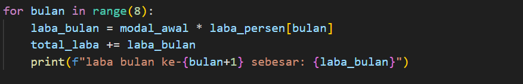

# latihan 1
## Alur Algoritma

### Langkah 1
masukan kode Import random supaya untuk menghasilkan bilangan acak:

### Langkah 2
Input jumlah bilangan n sebagai integrer:

### Langkah 3
Masukan variabel count untuk menghitung berapa banyak bialangan acak:

### Langkah 4
Masukan perulangan while untuk menentukan nilai count dibawah nilai n. maasukan dan input angka random. gunakan if untuk angka angka acak lebih kecil dari 0,5. jika angka memenuhi syarat dari 0,5 maka count=1, setelah itu diprint:

### Langkah 5
Setelah selesai lalu Print output:

### Hasil eksekusi progrsm
Masukan nilai n = 5:

# latihan 2

### Langkah 1
Inialisasi modal awal, sebesar 100 juta:

### Langkah 2
Masukan daftar laba_persen buat simpan persentase per bulan selama 8 bulan. 2 bulan pertama laba = 0, masukan laba bulan 3 dan 4 lalu dikali dengan 0,01. masukan laba bulan 5 sampai bulan 7 lalu kalikan dengan 0,05. masukan laba bulan 8. hasil laba dari bulan 1-8:

### Langkah 3
Inialisai totsl laba:

### Langkah 4
Gunakan loop for dan in, lalu hitung berdasarkan modal awal. operator += berguna untuk menulis penjumlahan dan penugasan secara bersamaan, lalu print:

### Langkah 5
Print output total laba:

### Hasil eksekusi program

# Latihan 3

### Langkah 1
Masukan nilai saldo sebesar 1.000.000:

### Langkah 2
Gunakan def untuk menampilkan perulangan, masukan saldo dan proses keluar:

### Langkah 3
Gunakan loop while true, supaya program terus berjalan sampai ada perintah break:

### Langkah 4
Input pilih menu 1/2:

### Langkah 5
if pilihan=1, penarikan jumlah uang yang ditarik dan diubah menjadi integrer:

### Langkah 6
if,elif,else menampilkan program saldo tidak cukup. jumlah yang dimasukkan kurang atau 0. jika valid pesan muncul berhasil, jika tidak muncul pesan error:

### Langkah 7
Gunakan elif break untuk menghentikan program jika memilih 2 dan menampilkan pesan:

### Langkah 8
Print selesai:

### Hasil eksekusi program
